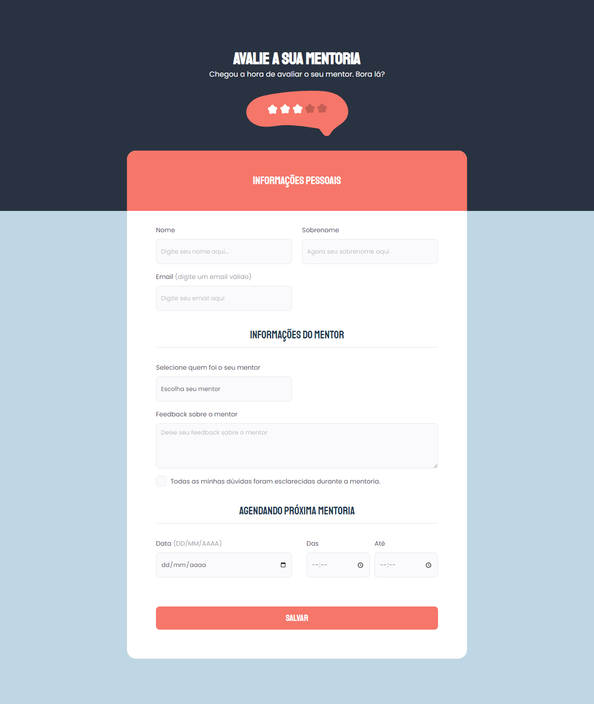
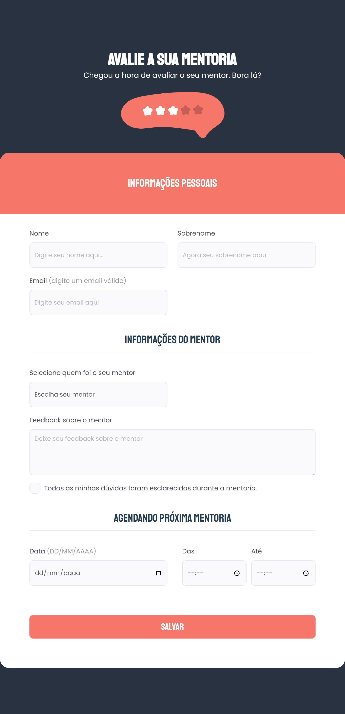
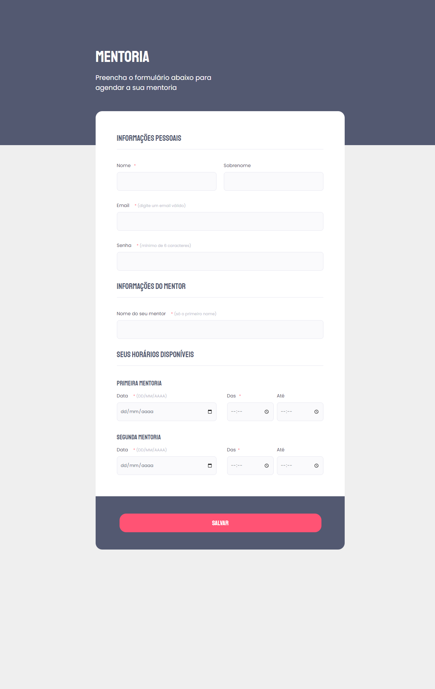

<h1 align="center">
Mentorship Form 2 - Agende sua mentoria
</h1>

## Indexes

- [About](#about)
- [Built in](#built_in)
- [Go to](#go_to)
- [Preview](#preview)

 

## About 

This project was made in the 1nd module of Explorer level 3 - Rocketseat.

In this project, I reinforced my knowledge about spacing, forms, pseudo-classes and responsiveness. I also further improved the unit of measurement for the root to make it easier to use REM values, i.e. now I can use the same px values as REM, example: 1px = 1 rem.

 

## Built in 

- HTML
- CSS

 

## Go to 

To access the site is simple, just click on the <a href = "https://mentorship-form-2.vercel.app">link</a>

 

## Preview 

   

### PC

  
  

### Mobile

  
  

### Tablet

  

